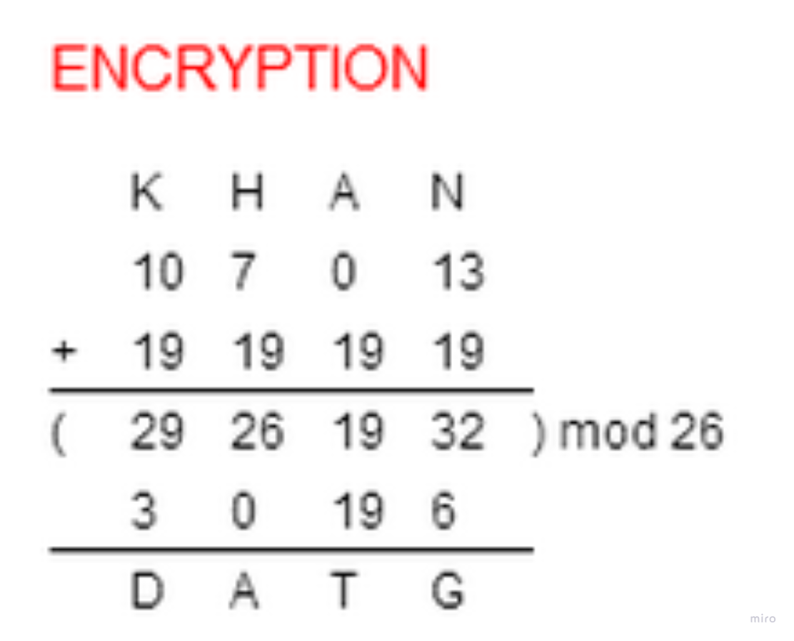
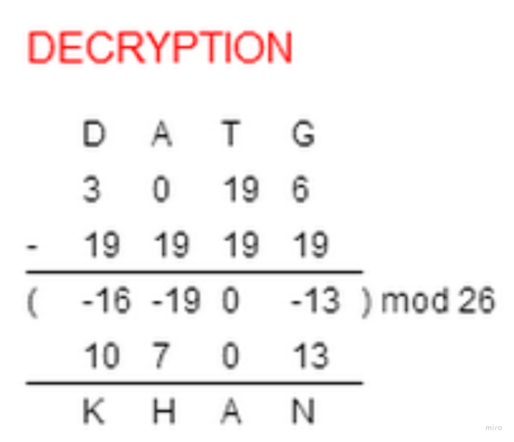

Please create 2 functions to do:
Caesar encryption
Caesar decryption

def caesar_encrypt(input_str, n):
 where input_str = input string
 where n = how many shifts

def caesar_decrypt(input_str, n):
    where input_str = input string
    where n = how many reverse shifts

https://www.khanacademy.org/computing/computer-science/cryptography/ciphers/a/shift-cipher
https://en.wikipedia.org/wiki/Caesar_cipher

