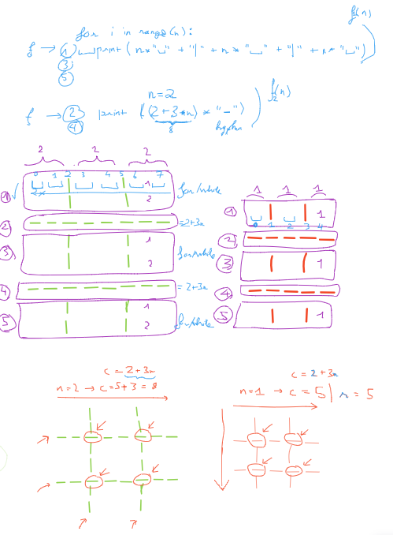

Please produce a Python block of code to print out the layout of a
tic-tac-toe

You are expected to:
Using some kinds of loops
Be able to configure how big your tic-tac-toe
n = 2
Save this tic-tact-toe layout into a file (.txt file)

always 3x3 tic-tac-toe, just wider/taller for large n

