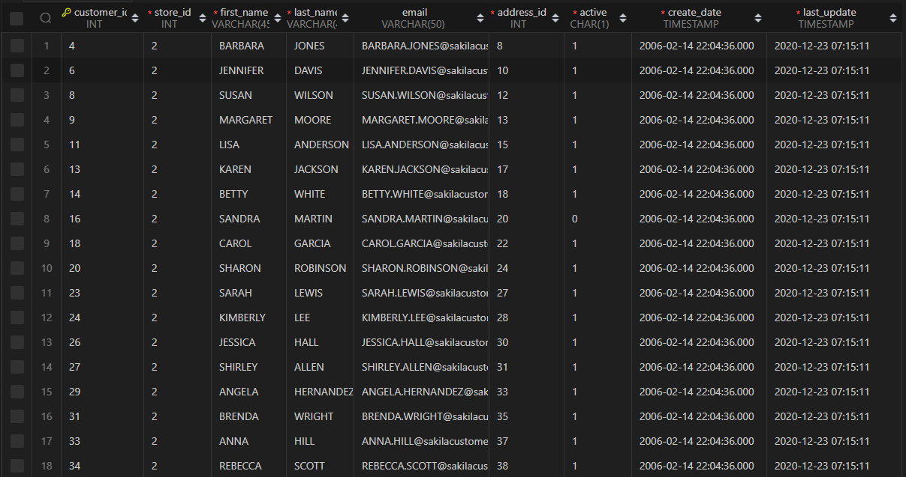
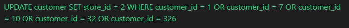
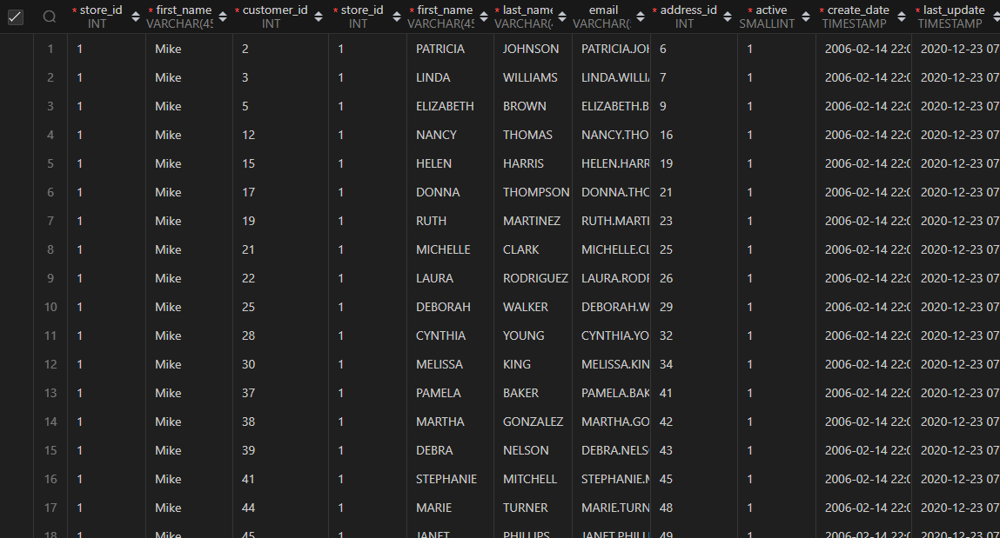
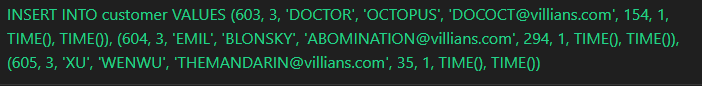
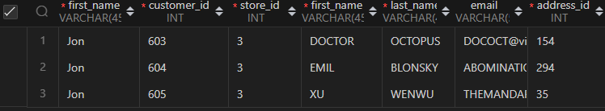

1)
SELECT * FROM customer WHERE store_id = 2

2)
INSERT INTO customer
VALUES
(600, 1, 'PETER', 'PARKER', 'PETER.PARKER@avengers.com', 605, 1, TIME(), TIME()),
(601, 2, 'BRUCE', 'BANNER', 'BRUCE.BANNER@avengers.com', 74, 1, TIME(), TIME()),
(602, 1, 'TONY', 'STARK', 'TONY.STARK@avengers.com', 294, 0, TIME(), TIME());

3)
UPDATE customer
SET store_id = 2
WHERE customer_id = 1 OR
customer_id = 7 OR
customer_id = 10 OR
customer_id = 32 OR
customer_id = 326;

4)
SELECT staff.store_id, customer.*
FROM customer
INNER JOIN staff ON staff.store_id = customer.store_id
WHERE staff.first_name = 'Mike';

5)
INSERT INTO store
VALUES
(3, 2, 27, TIME())

6)
INSERT INTO customer
VALUES
(603, 3, 'DOCTOR', 'OCTOPUS', 'DOCOCT@villians.com', 154, 1, TIME(), TIME()),
(604, 3, 'EMIL', 'BLONSKY', 'ABOMINATION@villians.com', 294, 1, TIME(), TIME()),
(605, 3, 'XU', 'WENWU', 'THEMANDARIN@villians.com', 35, 1, TIME(), TIME());

7)
SELECT staff.first_name, customer.*
FROM customer
INNER JOIN store ON store.store_id = customer.store_id
INNER JOIN staff ON staff.staff_id = store.manager_staff_id
WHERE customer.store_id = 3;

